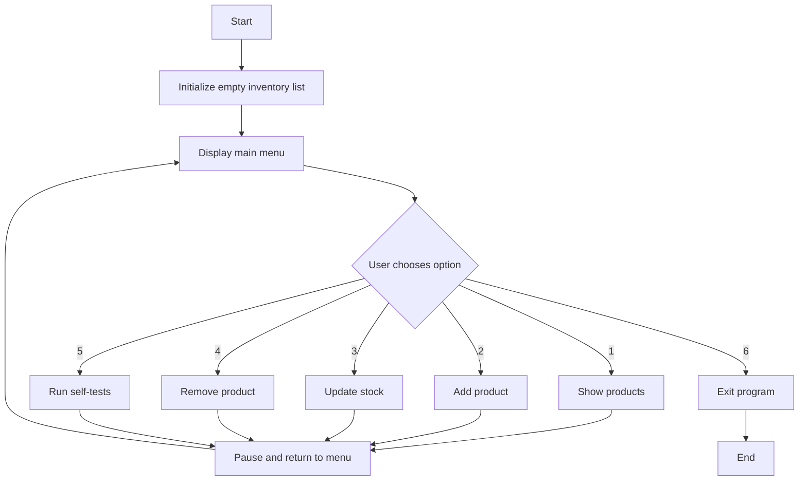

# Requirements and Design Outline

## Project Name
Inventory Management System

## 1. Requirements

### Functional requirements
1. The application must display a menu with options to manage inventory.
2. The user must be able to view all products currently stored in the inventory.
3. The user must be able to add a new product with the following information:
   - name
   - price
   - initial stock quantity
4. The user must be able to update the stock quantity of an existing product.
5. The user must be able to remove a product from the inventory.
6. The system must prevent invalid data, such as:
   - empty product names
   - negative prices
   - negative stock values
7. The system must prevent duplicate product names.
8. The system must provide a built-in self-test option to validate core operations.
9. The system must allow the user to exit the program at any time.

### Non-functional requirements
1. The application must be simple and easy to use through a console interface.
2. The program must be reliable and handle incorrect input safely.
3. The code must be easy to read and maintain.
4. The solution must be compatible with the .NET platform used in the project.
5. The application must respond quickly for small and medium-sized inventories.

## 2. Project Objectives

1. Build a console-based inventory management system that supports basic CRUD-like operations.
2. Implement data validation to avoid inconsistent or invalid inventory records.
3. Provide a clear and user-friendly menu-based interface.
4. Include automated built-in validation tests to demonstrate correct behavior.
5. Keep the project organized and easy to extend in the future.

## 3. Design Outline

### Main components
- Program entry point: controls the main menu loop and user interaction.
- Inventory data structure: stores products in memory using a list.
- Helper methods: handle input validation, inventory updates, and display logic.
- Self-test module: verifies the core functionality automatically.

### Planned tasks and code structures

| Task | Description | Type of code / structure |
|---|---|---|
| Show menu | Display the available operations to the user | `while` loop + `switch` |
| View products | Print each product and its current stock | `foreach` loop |
| Add product | Collect user input and store a new product | input validation + list insertion |
| Update stock | Find a product and adjust its stock value | `for` loop + conditional checks |
| Remove product | Delete a product from the inventory list | `for` loop + list removal |
| Validate input | Avoid empty names, negative values, and duplicates | `if` statements |
| Run self-tests | Check that important actions work correctly | custom test methods + assertions |
| Pause between actions | Keep the console UI readable | helper method |

### Proposed program flow

## 4. Expected Result
At the end of the project, the application should allow a user to manage a simple inventory through a console menu, with validation and built-in tests to ensure the main operations work correctly.
